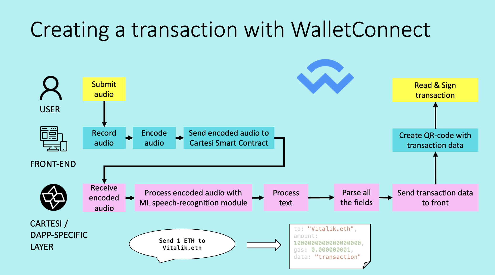
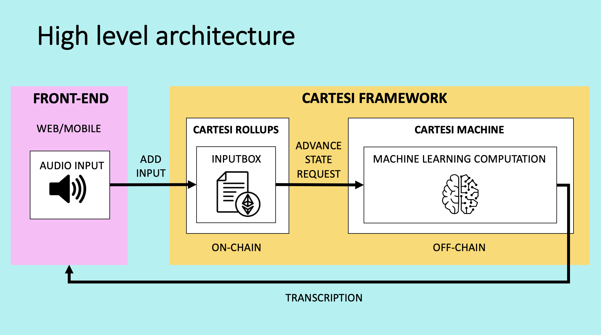

# VoiceSense

## Objective

VoiceSense is a decentralized application that uses voice commands to facilitate blockchain transactions. This tool enables individuals with visual impairments or reading difficulties to have the same seamless web3 experience as everyone else. VoiceSense also allows users to record speech in any language to initiate blockchain transactions, effectively eliminating language barriers on web3 and enabling users to transact on the blockchain in their native language. VoiceSense's decentralization aspect ensures security and trust for the most vulnerable web3 users.

## Functional description



Users record an input, such as "Send 1 ETH to Vitalik.eth". VoiceSense encodes the audio and forwards it through the base layer to an execution layer where the Machine Learning module, running inside a VM, handles speech recognition. The module processes this text, and maps it to all the necessary fields to create a transaction. For example, Send 1 ETH to Vitalik.eth translates into:

`Send 1 ETH to Vitalik.eth` would translate into:

```json
to: "Vitalik.eth",
amount: 1000000000000000000,
gas: 0.000000001,
data: "transaction"
```

The transaction is then created and sent to the wallet, where it is read and signed.

## High-level architecture



VoiceSense's core consists of an AI module operating within a Cartesi Machine, which is part of the Cartesi Rollups framework, on the execution layer. The front-end, a React application, has simple buttons for recording, playing back, and sending input. The input travels via Cartesi Smart contracts on the base layer to the Cartesi Machine, where it is converted into text, translated if necessary, and a transaction is created. This transaction is sent back to the front-end, where a wallet signs and dispatches it.

VoiceSense can connect with any wallet, but our MVP integration uses WalletConnect.

The Machine Learning module responsible for transaction verification is fully decentralized. If a malicious actor tampers with the module's computation, the transaction sender or any other network participant can challenge the fraudulent transaction constructed by the Cartesi Machine. If we ran the Machine Learning module on a centralized server, there would be no way to verify if the transaction had been compromised due to dishonest behavior or incorrect output from the Machine Learning module.

## Technology used

- VoiceSense's back-end is written in Python
- The front-end is a standard ReactJS application, encoding audio to Flac
- The back-end runs within a Cartesi Machine on a Cartesi Node
- The back-end uses the Hugging Face Machine Learning module to convert speech into text
- Communication to the WalletConnect wallet is done via the Web3Modal library

## Deployment history

1. We clone [Cartesi Rollups-examples repository](https://github.com/cartesi/rollups-examples).
2. We use the [Calculator DApp](https://github.com/cartesi/rollups-examples/tree/main/calculator) as a source.
3. We use the [Front-end echo](https://github.com/cartesi/rollups-examples/tree/main/frontend-echo) as a source for our front-end application.
4. We integrate the Hugging Face AI model into the back-end:

- We initially used the first version of the Hugging Face model, which is trained with 960 hours and does not recognise blockchain terminology.
- We then used the send, larger, version of the Hugging Face model, which is trained with thousands of hours.

## Deployment plan

### Stage 1 - deploy locally (host mode)

#### Run the environment

From the source repository of VoiceSense:

```shell
docker compose -f ../docker-compose.yml -f ./docker-compose.override.yml -f ../docker-compose-host.yml up
```

#### Run the application back-end

From the source repository of VoiceSense:

```shell
python3 -m venv .env
. .env/bin/activate
pip install -r requirements.txt
ROLLUP_HTTP_SERVER_URL="http://127.0.0.1:5004" python3 voiceSense.py
```

#### Run the application front-end

From the directory of the front-end:

```shell
yarn
yarn build
yarn start
```

The front-end is now running on `http://localhost:3000`.

#### Send input

1. Press `Record` button.
2. Press `Send` button.

The output is presented on the right hand side of the screen.

### Stage 2 - deploy in production on a TestNet

Due to the challenges outlined below, we didn't include deployment to a TestNet in the initial development stage of VoiceSense.

## Additional integration with XMPT

VoiceSense can be integrated into the XMTP flow.

## Additional integration with PUSH

VoiceSense can be integrated into the PUSH communication channels.

## Additional integration with layer 2 solutions

As Cartesi does not currently support deployment to the MainNeet out-of-the-box, VoiceSense can be deployed to the MainNet using an additional layer 2 solution.

## Challenges

### PyTorch support for Risc-V

VoiceSense uses PyTorch to run the speech recognition module. However, PyTorch currently lacks support and compilation for Risc-V architecture, so it cannot run inside the Cartesi Machine. This issue can be addressed by compiling a custom Machine Learning library locally and deploying it to the Cartesi Machine. The Cartesi team advised us that the compilation could take several weeks to complete. Alternatively, we could use another Machine Learning module with lower processing capacity.

### Long voice processing time

It takes up to 4 minutes to process audio input due to the application running locally. However, once the application is deployed on a Cartesi Machine, the full capacity of VoiceSense will be unlocked, significantly reducing processing time.

### QR code encoding

Our initial assumption that QR codes could read raw data was incorrect. Wallets consume data in a unique manner, and this logic isn't open-source for every wallet. To enable such data consumption, we need to fork an open-source wallet and build the logic to read the information.

### Lack of front-end for Cartesi example DApps

Cartesi doesn't provide a front-end application example that can be easily customized. To create VoiceSense, we had to repurpose the front-end of a simpler Cartesi DApp - Echo - and extensively modify it. Cartesi does not currently offer a template to support encoded audio, so this functionality had to be developed from scratch for VoiceSense.

### Lack of existing solutions to connect Cartesi to a wallet provider.

There were also no examples of integration with any wallet provider. We are the first to integrate Web3Modal with Cartesi.

### Audio formats

We had to switch the audio formats from web to Flac, as Hugging Face's ML modules are only trained with Flac files. Additionally, we had to send encoded audio through Cartesi Smart Contracts on the blockchain.

### Lack of out-of-the-box customisation for CArtesi DApps

Cartesi's [custom DApp template](https://github.com/cartesi/rollups-examples/tree/main/custom-dapps) is currently dysfunctional. To customize an existing Cartesi DApp example, we had to clone the Calculator DApp and use it as our base.

THINGS I LIKE TO SEE:

- MORE EXPLANAITON OF THE OBJECTIVE, MAYBE THE ONE AT THE ETHGLOBAL PAGE
- PUT VIDEO SCRIPT
- PUT PICTURES OF THE ARCHITECHTURE
- ALL THE INFORMATION HAS TO BE HERE
- EXPLAIN POSSIBLE IDEAS WE HAD (PUSH AND XMPT), ALSO DEPLOYMENTS ON LAYER 2s
- web3modal could be used to load our own custom wallet after forking it
